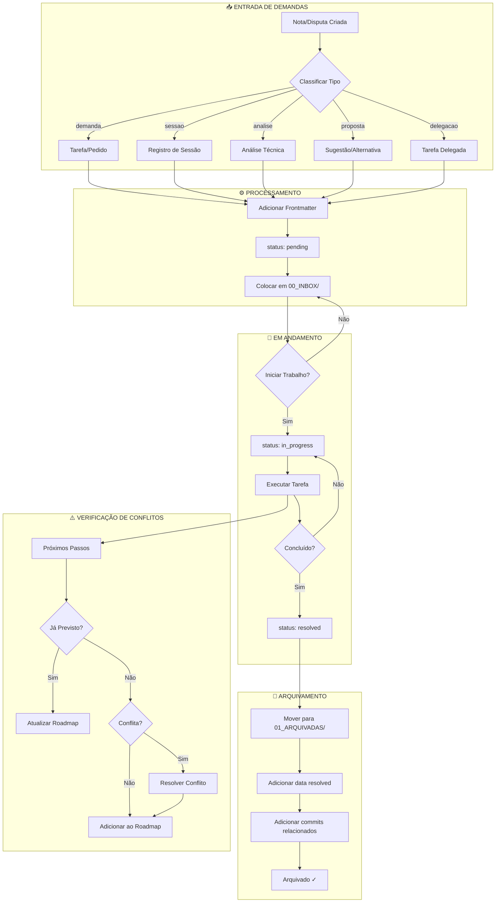
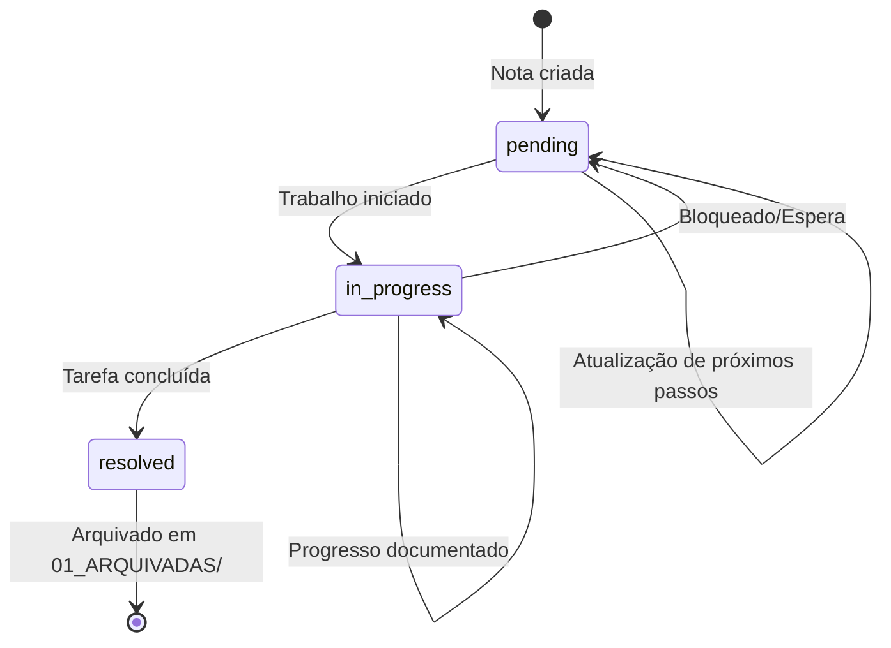
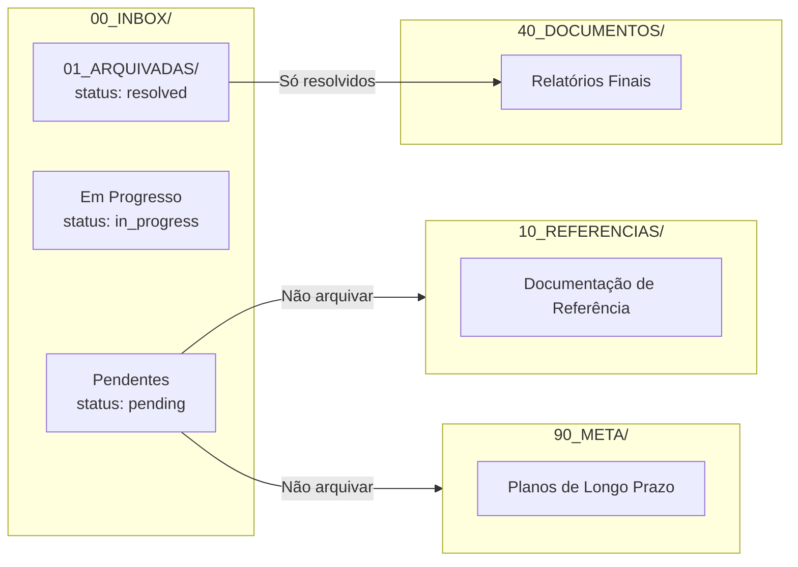
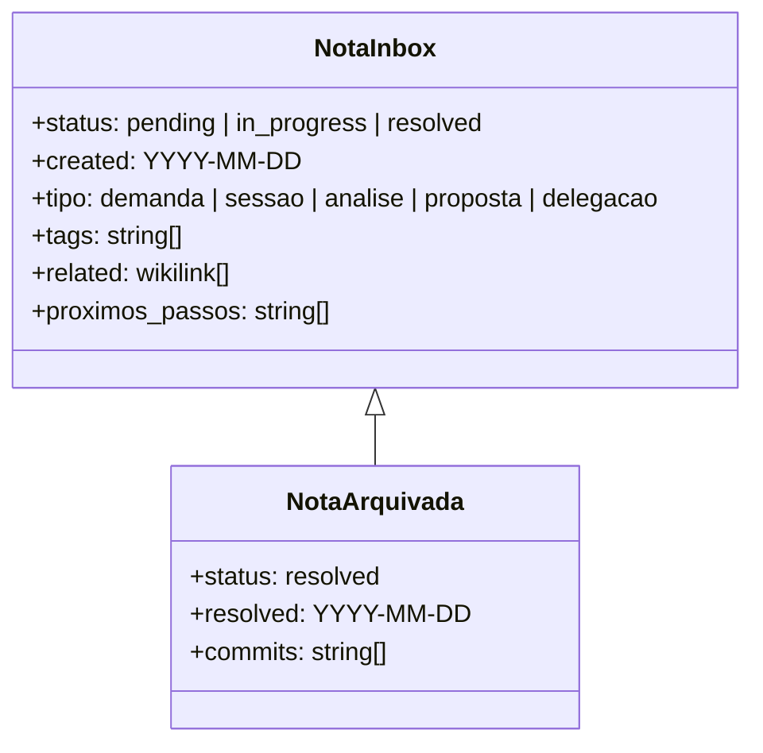
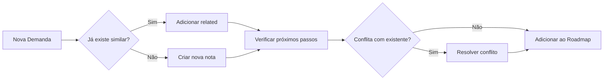

# Diagrama do Fluxo da Inbox

## Visão Geral do Sistema

---

## Ciclo de Vida de uma Nota

---

## Estrutura de Pastas

---

## Frontmatter Obrigatório

---

## Processo de Decisão

---

## Regras de Ouro

1. **Separar** resolvidos de pendentes (nunca misturar)
2. **Wikilinks** para conectar notas relacionadas
3. **Frontmatter** completo em todas as notas
4. **Próximos passos** sempre verificados contra Roadmap
5. **Commits** referenciados nas notas arquivadas

---

*Diagrama criado para documentar o sistema de inbox do secretario-agente-lke*
