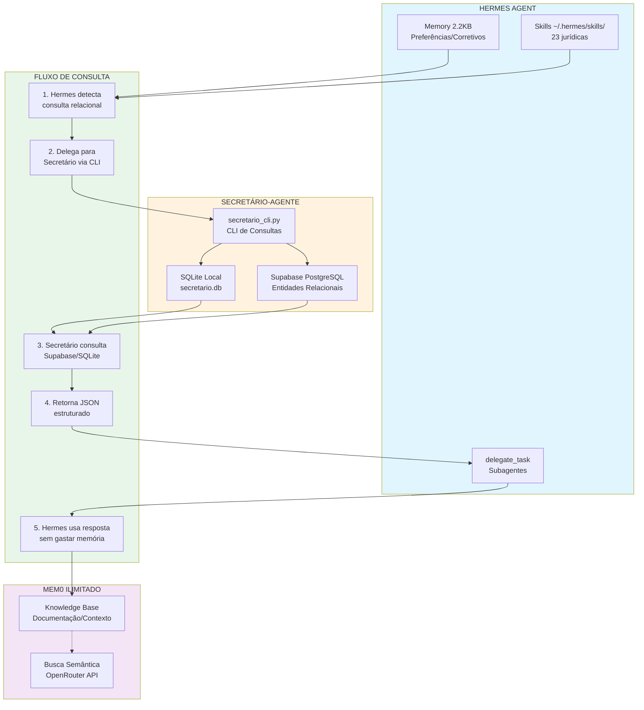
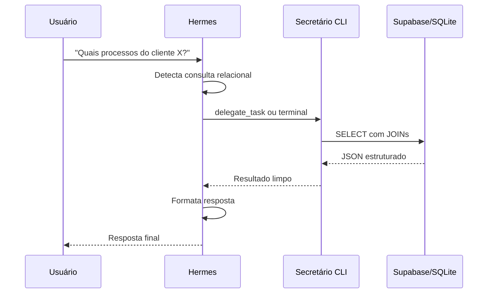

# Diagnóstico: Skills Hermes x Secretário-Agente

**Data:** 2026-04-14  
**Sessão:** T1.5.7  
**Contexto:** Verificação de skills personalizadas e integração com banco de dados do Secretário-Agente

---

## Resumo Executivo

O Hermes possui **23 skills jurídicas personalizadas** instaladas em `~/.hermes/skills/juridico/`. O Secretário-Agente LKE utiliza banco SQLite/Supabase com **17 tabelas relacionais**, mas **NÃO existe tabela de skills** no schema atual.

**Oportunidade:** Criar tabela `agent_skills` no Supabase para consolidar metadados das skills, permitindo:
1. Delegação de consultas do Hermes ao Secretário
2. Liberação de memória persistente do Hermes
3. Rastreabilidade de uso por sessão

---

## 1. Skills Jurídicas Cadastradas no Hermes

### 1.1 Lista Completa (23 skills)

| # | Nome | Categoria | Descrição |
|---|------|-----------|-----------|
| 1 | `analise-documental-emergencial-casos-juridicos` | jurídico | Protocolo para análise documental emergencial com prazos críticos |
| 2 | `central-pesquisas-peixoto-ops` | jurídico | Gerenciamento de pesquisas Johnny.Decimal + MCP tools |
| 3 | `commits-individuais-ordenados-cronologicamente` | jurídico | Commits ordenados com legal_commit |
| 4 | `correcao-projeto-dashboard-unificado` | jurídico | Correção de divisão de projetos no dashboard |
| 5 | `emergency-legal-case-analysis-protocol` | jurídico | Análise sistemática de casos jurídicos críticos |
| 6 | `execute-opencode-commits-individuais-workflow` | jurídico | Workflow manual de commits quando opencode indisponível |
| 7 | `git-init-safe-check` | jurídico | Prevenção de git init catastrófico |
| 8 | `migracao-sqlite-para-supabase` | jurídico | Workflow de migração SQLite → Supabase |
| 9 | `secretario-agente-lke` | jurídico | **Agente secretário com banco relacional** |
| 10 | `sessao-t1.4.3-dashboard-streamlit-duplicate-key-fix` | jurídico | Fix de StreamlitDuplicateElementKey |
| 11 | `sistema-analise-infraestrutura-ingestao-lke` | jurídico | Análise de infraestrutura de ingestão |
| 12 | `sistema-analise-ingestao-ecosistema` | jurídico | Diagnóstico de patterns Fabric |
| 13 | `sistema-avaliacao-risco-propostas-juridicas` | jurídico | Scoring de risco 4 dimensões |
| 14 | `sistema-correcao-dashboard-streamlit-problemas-comuns` | jurídico | Correção de problemas comuns Streamlit |
| 15 | `sistema-criacao-repositorio-satelite-casos-juridicos` | jurídico | Criação de repositórios satélite LKE |
| 16 | `sistema-criacao-templates-reutilizaveis-projetos` | jurídico | Templates reutilizáveis com abstração de secrets |
| 17 | `sistema-dashboard-streamlit-juridico-lke` | jurídico | Dashboards jurídicos LKE |
| 18 | `sistema-gestao-crise-juridica-emergencial` | jurídico | Gestão de crise com prazos vencidos |
| 19 | `sistema-guardiao-credenciais-juridico` | jurídico | Gestão centralizada de credenciais |
| 20 | `sistema-health-scoring-casos-juridicos` | jurídico | Health scoring 0-100 com 10 dimensões |
| 21 | `sistema-implementacao-importador-real-substituicao-stub` | jurídico | Substituição de stubs por importadores reais |
| 22 | `sistema-resgate-repositorio-contaminado` | jurídico | Resgate de projetos contaminados |
| 23 | `sistema-versionamento-infraestrutura-pesquisas` | jurídico | Versionamento de infraestruturas |

### 1.2 Skills por Tipo de Uso

**Fluxo de Trabalho:**
- `secretario-agente-lke` - Consultas ao banco
- `commits-individuais-ordenados-cronologicamente`
- `execute-opencode-commits-individuais-workflow`

**Análise e Diagnóstico:**
- `analise-documental-emergencial-casos-juridicos`
- `emergency-legal-case-analysis-protocol`
- `sistema-analise-infraestrutura-ingestao-lke`
- `sistema-analise-ingestao-ecosistema`
- `sistema-health-scoring-casos-juridicos`
- `sistema-avaliacao-risco-propostas-juridicas`

**Correção e Resgate:**
- `git-init-safe-check`
- `sistema-resgate-repositorio-contaminado`
- `correcao-projeto-dashboard-unificado`
- `sistema-correcao-dashboard-streamlit-problemas-comuns`
- `sessao-t1.4.3-dashboard-streamlit-duplicate-key-fix`

**Criação e Setup:**
- `sistema-criacao-repositorio-satelite-casos-juridicos`
- `sistema-criacao-templates-reutilizaveis-projetos`
- `sistema-versionamento-infraestrutura-pesquisas`

**Integração:**
- `migracao-sqlite-para-supabase`
- `sistema-guardiao-credenciais-juridico`
- `sistema-implementacao-importador-real-substituicao-stub`
- `central-pesquisas-peixoto-ops`

---

## 2. Banco de Dados do Secretário-Agente

### 2.1 Tabelas Existentes (SQLite/Supabase)

```
TABELAS NO BANCO:
├── clientes
├── processos
├── repositorios
├── prazos
├── comunicacoes
├── credenciais
├── sessoes
├── sessao_tags
├── tags
├── atividade_logs
├── artefatos
├── schema_versao
├── vinculos_cliente_processo
├── vinculos_repositorio_processo
├── vw_atividade_recente (view)
└── vw_sessoes_resumo (view)
```

### 2.2 TABELA AUSENTE: `agent_skills`

**Gap identificado:** Não existe tabela para rastrear skills do Hermes.

**Schema proposto:**

```sql
CREATE TABLE agent_skills (
    id UUID PRIMARY KEY DEFAULT uuid_generate_v4(),
    nome VARCHAR(100) UNIQUE NOT NULL,
    categoria VARCHAR(50),
    descricao TEXT,
    path TEXT NOT NULL,
    ferramentas JSONB,
    triggers JSONB,
    uso_count INT DEFAULT 0,
    ultima_utilizacao TIMESTAMP,
    ativo BOOLEAN DEFAULT TRUE,
    criado_em TIMESTAMP DEFAULT CURRENT_TIMESTAMP,
    atualizado_em TIMESTAMP DEFAULT CURRENT_TIMESTAMP
);

-- Tabela de vínculo sessão x skills (N:N)
CREATE TABLE sessao_skills (
    id UUID PRIMARY KEY DEFAULT uuid_generate_v4(),
    sessao_id UUID REFERENCES sessoes(id),
    skill_id UUID REFERENCES agent_skills(id),
    resultado VARCHAR(50),
    duracao_segundos INT,
    UNIQUE(sessao_id, skill_id)
);
```

---

## 3. Arquitetura de Memória Desacoplada

### 3.1 Diagrama Mermaid



### 3.2 Fluxo de Delegação



---

## 4. Benefícios da Integração

### 4.1 Liberação de Memória Hermes

| Atualmente | Com Secretário |
|------------|----------------|
| Hermes armazena ~2KB de preferências | Hermes mantém apenas essenciais |
| Consultas repetem contexto | Secretário cacheia resultados |
| Memória enchendo com entidades | Entidades ficam no banco |

### 4.2 Capacidades do Secretário

```bash
# Consultar processos de um cliente
python secretario_cli.py query "SELECT * FROM processos WHERE cliente_id = '...'"

# Listar repositórios ativos
python secretario_cli.py repos --ativos

# Status do sistema
python secretario_cli.py status

# Registrar sessão
python secretario_cli.py sessao --titulo "T1.5.7" --tipo "setup"
```

### 4.3 Workflow de Integração

1. **Hermes detecta consulta relacional** →
2. **Chama secretario_cli.py** via terminal ou delegate_task →
3. **Secretário consulta banco** →
4. **Retorna JSON estruturado** →
5. **Hermes usa resposta sem armazenar**

---

## 5. Próximos Passos

### 5.1 Imediato (Próxima Sessão)

1. Criar tabela `agent_skills` no Supabase
2. Popular com 23 skills jurídicas existentes
3. Criar script de sync: `sync_skills_to_supabase.py`

### 5.2 Médio Prazo

1. Integrar consulta ao Secretário no fluxo do Hermes
2. Criar skill de delegação automática
3. Implementar health check de sincronização

### 5.3 Longo Prazo

1. Dashboard de uso de skills por sessão
2. Métricas de eficiência de memória
3. Alertas de dessincronização

---

## 6. Arquivos de Referência

| Arquivo | Local | Conteúdo |
|---------|-------|----------|
| `secretario_cli.py` | `30_IMPLEMENTACAO/` | CLI de consultas |
| `migrate_to_supabase.py` | `30_IMPLEMENTACAO/` | Script de migração |
| `secretario.db` | `10_REFERENCIAS/` | Banco SQLite local |
| `SKILL.md` (cada) | `~/.hermes/skills/juridico/*/` | Metadados da skill |

---

*Diagnóstico gerado pelo Hermes Agent - Sessão T1.5.7 - 14/04/2026*
